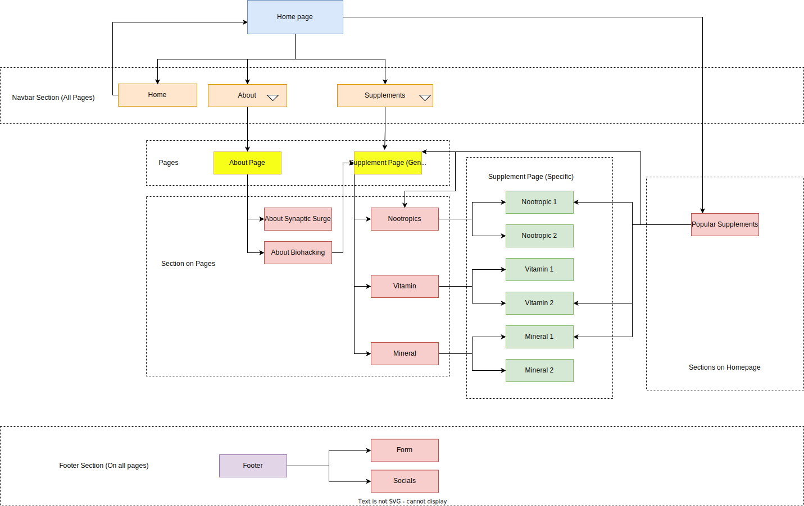

# Synaptic Surge

The project, *Synaptic Surge*, is designed with the aim of educating users about everything related to biohacking. The information will be distilled into manageable segments to counteract the *information overload* that many visitors might experience on similar sites. This platform caters to both novices interested in exploring the world of biohacking and seasoned veterans seeking to refine their knowledge in specific areas. In addition, a newsletter sign-up will be available to keep subscribers updated on any new scientific developments relevant to the topic at hand.

<h2>User Experience Design (UXD)</h2>

<h3>Strategy</h3>

<h4>User Stories</h4>

#### First Time Visitor Goals ####

- As a First Time user, I want to easily understand the main purpose of the site and learn more about the concepts of Biohacking.
- As a First Time user, I want to be able to easily navigate throughout the site to find informative content and educational resources.
- As a First Time user, I want to view the website and content clearly on my mobile device.
- As a First Time user, I want to find ways to follow the Biohacking education platform on different social media platforms.

#### Returning Visitor Goals ####

- As a Returning user, I want to find and explore new content and resources about Biohacking so that I can continue my learning journey.
- As a Returning user, I want to be able to interact with other users or experts in the field, so I can deepen my understanding and share ideas.
- As a Returning user, I want to contact the organisation so I can request more information or suggest topics for future content.

#### Frequent Visitor Goals ####

- As a Frequent user, I want to check to see if there are any new articles, videos, or resources about Biohacking.
- As a Frequent user, I want to check to see if there are any new developments or trends in the field of Biohacking.
- As a Frequent user, I want to sign up for the Newsletter so that I am emailed any major updates and/or changes to the website or new insights in the field of Biohacking.

<h4>Site Owner Goals</h4>

- As a Site Owner, I want to create an intuitive and responsive website that effectively educates users about Biohacking.
- As a Site Owner, I want to be able to inform users of new content, resources, or changes to the site, keeping them engaged and up-to-date.
- As a Site Owner, I want to generate revenue by promoting relevant products, services, or partnerships related to Biohacking.
- As a Site Owner, I want more exposure for the website's social media pages to build a broader community around the subject of Biohacking.
- As a Site Owner, I want to be able to receive communication from site visitors, allowing for feedback, content suggestions, and community interaction.
- As a Site Owner, I want to be able to show visitors the team behind the website, to build trust and further establish the site's credibility in the field of Biohacking.

<h4>Competition</h4>

I have found a variety of sites that include information on Biohacking; [Biohackers Lab](https://www.biohackerslab.com/), [David Asprey](https://daveasprey.com/), [Biohacking Collective](https://biohackingcollective.com/), [Found My Fitness](https://www.foundmyfitness.com/), [Quantified Self](https://quantifiedself.com/), and [Ben Greenfield Life](https://bengreenfieldlife.com/). Many of them seem to revolve around a personality, which gives the information on the site more credibility. This would be difficult to compete with currently, however, with a successful, monetizable site I could hire scientific professionals to give *Synaptic Surge* more credence. When in comes to design the sites have several strengths and weaknesses:

[Biohackers Lab](https://www.biohackerslab.com/)

Strengths

- Clean and organised layout
- Good colour contrast between the orange and white
- Has a variety of content; text, images, videos & podcasts

Weaknesses

- Navbar isn't sticky which requires unnecessary scrolling to navigate the site
- Sections could be broken up with more colours instead of being white
- Poor colour contrast on certain pages between black and orange. Should be orange and white
- Generally responsive but fonts seem to big on mobile and the content could be broken up more

[David Asprey](https://daveasprey.com/)

Strengths

- Authoritative site due to it being linked with David Asprey (*Father of Biohacking*)
- Hover interactions on all elements
- High quality images

Weaknesses

- Black and yellow lines on homepage don't really work. I understand that it's part of his book *Smarter Not Harder* but it doesn't fit the otherwise clean blue and white colour scheme
- Articles could be broken up into sub-categories
- Generally responsive but navigation doesn't display properly on mobile

[Biohacking Collective](https://biohackingcollective.com/)

Strengths

- Responsive
- Good colour contrast

Weaknesses

- Poor layout, it's difficult to find specific information

[Found My Fitness](https://www.foundmyfitness.com/)

Strengths

- Authoritative site due to it's link with Dr. Rhonda Patrick
- Responsive
- Good colour contrast
- Clean and organised layout

Weaknesses

- Limited interaction on elements leave it feeling a bit data
- A lot of scrolling on mobile when looking at 'Topics' articles

[Quantified Self](https://quantifiedself.com/)

Strengths

- Minimalist design focused on content
- Text, images & videos
- Responsive

Weaknesses

- Poor contrast on hover elements

[Ben Greenfield Life](https://bengreenfieldlife.com/)

Strengths

- Good colour scheme
- Text, images, videos, podcasts

Weaknesses

- Poor contrast on hover elements
- Difficult to find sought after information on mobile
- A lot of scrolling to find certain articles

Many of these sites produce podcasts, which is currently an unattainable content feature. However, I believe there is a potential niche in the podcast space for anecdotal podcasts, where I would interview users of *Synaptic Surge* and listen to their Biohacking experiences. This approach has proven successful with content creators such as:

- Dr Anthony Chaffe - His focus is on the Carnivore Diet and its myriad of benefits
- Jake Steiner - His focus is on eyesight, specifically managing and even reversing myopia
Dr Chaffe also interviews scientific peers, but I believe his interviews with regular people are quite powerful, as are Jake's, because it makes the subject matter more relatable.

In addition to the sites focused specifically on biohacking, there are other platforms like Healthline and Medical News Today that cover a broader range of topics, including biohacking. These websites generally have a clear and intuitive design, with well-structured content. However, they can sometimes overwhelm users with an excessive amount of information. To improve the user experience, it would be beneficial for these sites to break down their content into more manageable chunks, while still providing clear information. This can be achieved by employing techniques that reduce visual clutter, such as using collapsible sections, implementing clear headings and subheadings, and incorporating interactive elements that allow users to explore the content at their own pace. By presenting information in a more digestible format, these websites could enhance usability and make it easier for users to find the specific information they are looking for.

<h4>Competition Revisited</h4>

I have decided to revisit the strategy plane after working on the scope. Biohacking is a vast topic, and I believe I should start with a smaller vertical slice so that the site has a strong focus to begin with and then can be expanded once that area is covered (*The long WOW!*). I have decided to focus on Nootropics as it's an area that I believe isn't as well known as other areas of Biohacking such as nutrition, exercise, and sleep.

The competition for this specific area features a variety of different sites; [Braintropic](https://www.braintropic.com/), [Neurohacker](https://neurohacker.com/), [Quantified Bob](https://www.quantifiedbob.com/), and [Nootriment](https://nootriment.com/). Compared to the Biohacking sites, these Nootropic sites don't have a focus on personalities but instead on education with links to scientific studies. This is more in line with what I had in mind for the MVP of *Synaptic Surge*. I think [Braintropic](https://www.braintropic.com/) and [Nootriment](https://nootriment.com/) do a great job of presenting information in a coherent, structured way, but this could still be improved, especially on mobile.

<h4>Strategy Tradeoffs</h4>

    
<h3>Scope</h3>

    
<h4>Sprint 1</h4>

#### Sprint 1 Features ####

- Landing Page
- Nav Bar
- Responsive website
- An education page template to fulfil *Educate users about Biohacking*. The first entries to use this template will be:
  1. Supplementation: This includes the use of various supplements, such as vitamins, minerals, and nootropics, that are believed to enhance various aspects of health and performance, including cognitive function
- About Page - to fulfil *Educate users about Biohacking*
- Basic Form - to fulfil *Sign up for site updates / new scientific studies*
- Footer with socials - to fulfil *Increase Social media presence*

#### Sprint 1 Requirement Types ####

- Languages: HTML, CSS & Javascript
- [formspree](https://formspree.io/) (To log form action data)
- Text
- Images
- Video

    
<h4>Sprint 2</h4>

#### Sprint 2 Features ####

- Search Bar - to fulfil *Ability to search for keywords*

#### Sprint 2 Requirement Types ####

- Languages: HTML, CSS & Javascript

    
<h4>Sprint 3+</h4>

#### Sprint 3+ Features ####

- More information on biohacking - to fulfil the ongoing business goal; *Educate users about Biohacking*
  1. Nutrition and Diet: Biohackers pay close attention to what they consume, and often experiment with different diets (such as ketogenic, paleo, or intermittent fasting) to see how they affect health and performance
  2. Exercise and Physical Activity: Biohackers often use specific exercise regimens to improve physical and mental health. This can range from traditional workout routines to more cutting-edge approaches like high-intensity interval training (HIIT) or electrical muscle stimulation
  3. Sleep Optimization: Many biohackers focus on improving both the quantity and quality of their sleep, often using various tracking devices to monitor their sleep patterns and make necessary adjustments
  4. Meditation and Mindfulness: This includes practices that improve mental health and reduce stress, such as mindfulness exercises, breathing techniques, and various forms of meditation
  5. Technology: Biohackers often use wearable technology to track various health metrics (like heart rate variability or sleep patterns) and make data-informed decisions about their lifestyle changes
  6. Genetic and Microbiome Testing: Some biohackers use genetic testing to understand their genetic predispositions and make lifestyle changes accordingly. Similarly, microbiome testing can provide information about gut health, which is increasingly recognized as a significant factor in overall health
  7. Environmental Design: This can involve optimizing personal living and working spaces to support health and well-being, such as using standing desks, optimizing light for circadian rhythms, or using air purifiers to improve air quality
- Forum - to fulfil *Ability to converse with other users and experts*
- Advanced Search - to fulfil *Ability to search by specific requirement e.g. Mood, Depression, Sleep, etc*
- Advanced Form - to fulfil *Individual form choice so users get the specific information they want*
- Podcasts - to fulfil *Anecdotal evidence from users*

#### Sprint 3+ Requirement Types ####

- Languages: HTML, CSS & JavaScript, Python (perhaps node.js instead), SQL
- Framework: NodeJs (Either this or python for the backend)
- Text
- Images
- Video
- Audio

    
<h3>Structure</h3>

Touchpoints - Responsive Website

