# Synaptic Surge

The project, *Synaptic Surge*, is designed with the aim of educating users about everything related to biohacking. The information will be distilled into manageable segments to counteract the *information overload* that many visitors might experience on similar sites. This platform caters to both novices interested in exploring the world of biohacking and seasoned veterans seeking to refine their knowledge in specific areas. In addition, a newsletter sign-up will be available to keep subscribers updated on any new scientific developments relevant to the topic at hand.

This repository is a clone of the original project that I submitted to the Code Institute. You can view the original project as it was at the time of submission at the following link: https://github.com/CharlieMcGoldrick/ci-ms1-synaptic-surge.

I have cloned this project to continue developing and expanding on it. As I make updates and improvements, they will be pushed to this repository, allowing the site to evolve beyond its initial submission state.

<h2>User Experience Design (UXD)</h2>

<h3>Strategy</h3>

<h4>User Stories</h4>

#### First Time Visitor Goals ####

- As a First Time user, I want to easily understand the main purpose of the site and learn more about the concepts of Biohacking.
- As a First Time user, I want to be able to easily navigate throughout the site to find informative content and educational resources.
- As a First Time user, I want to view the website and content clearly on my mobile device.
- As a First Time user, I want to find ways to follow the Biohacking education platform on different social media platforms.

#### Returning Visitor Goals ####

- As a Returning user, I want to find and explore new content and resources about Biohacking so that I can continue my learning journey.
- As a Returning user, I want to be able to interact with other users or experts in the field, so I can deepen my understanding and share ideas.
- As a Returning user, I want to contact the organisation so I can request more information or suggest topics for future content.

#### Frequent Visitor Goals ####

- As a Frequent user, I want to check to see if there are any new articles, videos, or resources about Biohacking.
- As a Frequent user, I want to check to see if there are any new developments or trends in the field of Biohacking.
- As a Frequent user, I want to sign up for the Newsletter so that I am emailed any major updates and/or changes to the website or new insights in the field of Biohacking.

<h4>Site Owner Goals</h4>

- As a Site Owner, I want to create an intuitive and responsive website that effectively educates users about Biohacking.
- As a Site Owner, I want to be able to inform users of new content, resources, or changes to the site, keeping them engaged and up-to-date.
- As a Site Owner, I want to generate revenue by promoting relevant products, services, or partnerships related to Biohacking.
- As a Site Owner, I want more exposure for the website's social media pages to build a broader community around the subject of Biohacking.
- As a Site Owner, I want to be able to receive communication from site visitors, allowing for feedback, content suggestions, and community interaction.
- As a Site Owner, I want to be able to show visitors the team behind the website, to build trust and further establish the site's credibility in the field of Biohacking.

<h4>Competition</h4>

I have found a variety of sites that include information on Biohacking; [Biohackers Lab](https://www.biohackerslab.com/), [David Asprey](https://daveasprey.com/), [Biohacking Collective](https://biohackingcollective.com/), [Found My Fitness](https://www.foundmyfitness.com/), [Quantified Self](https://quantifiedself.com/), and [Ben Greenfield Life](https://bengreenfieldlife.com/). Many of them seem to revolve around a personality, which gives the information on the site more credibility. This would be difficult to compete with currently, however, with a successful, monetizable site I could hire scientific professionals to give *Synaptic Surge* more credence. When in comes to design the sites have several strengths and weaknesses:

[Biohackers Lab](https://www.biohackerslab.com/)

Strengths

- Clean and organised layout
- Good colour contrast between the orange and white
- Has a variety of content; text, images, videos & podcasts

Weaknesses

- Navbar isn't sticky which requires unnecessary scrolling to navigate the site
- Sections could be broken up with more colours instead of being white
- Poor colour contrast on certain pages between black and orange. Should be orange and white
- Generally responsive but fonts seem to big on mobile and the content could be broken up more

[David Asprey](https://daveasprey.com/)

Strengths

- Authoritative site due to it being linked with David Asprey (*Father of Biohacking*)
- Hover interactions on all elements
- High quality images

Weaknesses

- Black and yellow lines on homepage don't really work. I understand that it's part of his book *Smarter Not Harder* but it doesn't fit the otherwise clean blue and white colour scheme
- Articles could be broken up into sub-categories
- Generally responsive but navigation doesn't display properly on mobile

[Biohacking Collective](https://biohackingcollective.com/)

Strengths

- Responsive
- Good colour contrast

Weaknesses

- Poor layout, it's difficult to find specific information

[Found My Fitness](https://www.foundmyfitness.com/)

Strengths

- Authoritative site due to it's link with Dr. Rhonda Patrick
- Responsive
- Good colour contrast
- Clean and organised layout

Weaknesses

- Limited interaction on elements leave it feeling a bit data
- A lot of scrolling on mobile when looking at 'Topics' articles

[Quantified Self](https://quantifiedself.com/)

Strengths

- Minimalist design focused on content
- Text, images & videos
- Responsive

Weaknesses

- Poor contrast on hover elements

[Ben Greenfield Life](https://bengreenfieldlife.com/)

Strengths

- Good colour scheme
- Text, images, videos, podcasts

Weaknesses

- Poor contrast on hover elements
- Difficult to find sought after information on mobile
- A lot of scrolling to find certain articles

Many of these sites produce podcasts, which is currently an unattainable content feature. However, I believe there is a potential niche in the podcast space for anecdotal podcasts, where I would interview users of *Synaptic Surge* and listen to their Biohacking experiences. This approach has proven successful with content creators such as:

- Dr Anthony Chaffe - His focus is on the Carnivore Diet and its myriad of benefits
- Jake Steiner - His focus is on eyesight, specifically managing and even reversing myopia
Dr Chaffe also interviews scientific peers, but I believe his interviews with regular people are quite powerful, as are Jake's, because it makes the subject matter more relatable.

In addition to the sites focused specifically on biohacking, there are other platforms like Healthline and Medical News Today that cover a broader range of topics, including biohacking. These websites generally have a clear and intuitive design, with well-structured content. However, they can sometimes overwhelm users with an excessive amount of information. To improve the user experience, it would be beneficial for these sites to break down their content into more manageable chunks, while still providing clear information. This can be achieved by utilising techniques that reduce visual clutter, such as using collapsible sections, implementing clear headings and subheadings, and incorporating interactive elements that allow users to explore the content at their own pace. By presenting information in a more digestible format, these websites could enhance usability and make it easier for users to find the specific information they are looking for.

<h4>Competition Revisited</h4>

I have decided to revisit the strategy plane after working on the scope. Biohacking is a vast topic, and I believe I should start with a smaller vertical slice so that the site has a strong focus to begin with and then can be expanded once that area is covered (*The long WOW!*). I have decided to focus on Nootropics as it's an area that I believe isn't as well known as other areas of Biohacking such as nutrition, exercise, and sleep.

The competition for this specific area features a variety of different sites; [Braintropic](https://www.braintropic.com/), [Neurohacker](https://neurohacker.com/), [Quantified Bob](https://www.quantifiedbob.com/), and [Nootriment](https://nootriment.com/). Compared to the Biohacking sites, these Nootropic sites don't have a focus on personalities but instead on education with links to scientific studies. This is more in line with what I had in mind for the MVP of *Synaptic Surge*. I think [Braintropic](https://www.braintropic.com/) and [Nootriment](https://nootriment.com/) do a great job of presenting information in a coherent, structured way, but this could still be improved, especially on mobile.

<h4>Strategy Tradeoffs</h4>

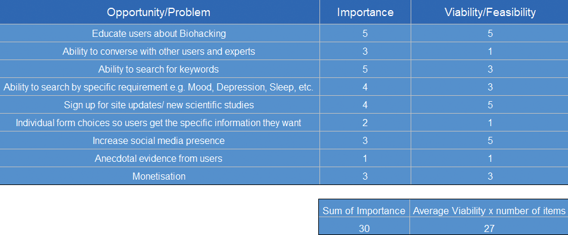

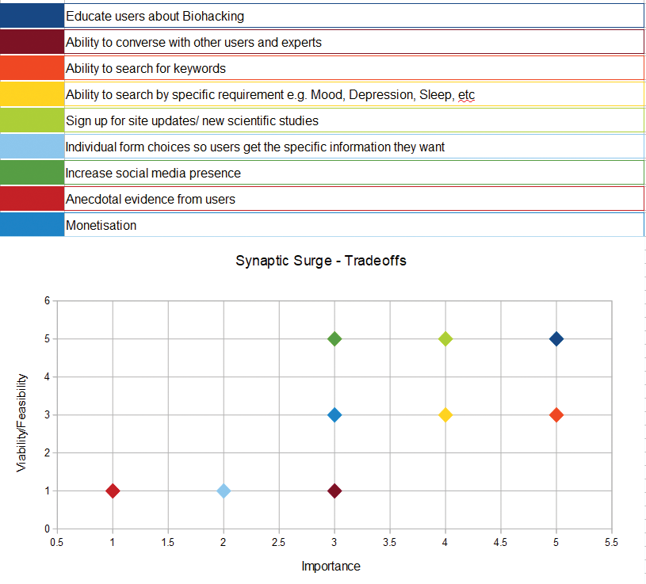

    
<h3>Scope</h3>

    
<h4>Sprint 1</h4>

#### Sprint 1 Features ####

- Landing Page
- Nav Bar
- Responsive website
- An education page template to fulfil *Educate users about Biohacking*. The first entries to use this template will be:
  1. Supplementation: This includes the use of various supplements, such as vitamins, minerals, and nootropics, that are believed to enhance various aspects of health and performance, including cognitive function
- About Page - to fulfil *Educate users about Biohacking*
- Basic Form - to fulfil *Sign up for site updates / new scientific studies*
- Footer with socials - to fulfil *Increase Social media presence*

#### Sprint 1 Requirement Types ####

- Languages: HTML, CSS & Javascript
- Text
- Images
- Video

    
<h4>Sprint 2</h4>

#### Sprint 2 Features ####

- Search Bar - to fulfil *Ability to search for keywords*

#### Sprint 2 Requirement Types ####

- Languages: HTML, CSS & Javascript

    
<h4>Sprint 3+</h4>

#### Sprint 3+ Features ####

- More information on biohacking - to fulfil the ongoing business goal; *Educate users about Biohacking*
  1. Nutrition and Diet: Biohackers pay close attention to what they consume, and often experiment with different diets (such as ketogenic, paleo, or intermittent fasting) to see how they affect health and performance
  2. Exercise and Physical Activity: Biohackers often use specific exercise regimens to improve physical and mental health. This can range from traditional workout routines to more cutting-edge approaches like high-intensity interval training (HIIT) or electrical muscle stimulation
  3. Sleep Optimization: Many biohackers focus on improving both the quantity and quality of their sleep, often using various tracking devices to monitor their sleep patterns and make necessary adjustments
  4. Meditation and Mindfulness: This includes practices that improve mental health and reduce stress, such as mindfulness exercises, breathing techniques, and various forms of meditation
  5. Technology: Biohackers often use wearable technology to track various health metrics (like heart rate variability or sleep patterns) and make data-informed decisions about their lifestyle changes
  6. Genetic and Microbiome Testing: Some biohackers use genetic testing to understand their genetic predispositions and make lifestyle changes accordingly. Similarly, microbiome testing can provide information about gut health, which is increasingly recognized as a significant factor in overall health
  7. Environmental Design: This can involve optimizing personal living and working spaces to support health and well-being, such as using standing desks, optimizing light for circadian rhythms, or using air purifiers to improve air quality
- Forum - to fulfil *Ability to converse with other users and experts*
- Advanced Search - to fulfil *Ability to search by specific requirement e.g. Mood, Depression, Sleep, etc*
- Advanced Form - to fulfil *Individual form choice so users get the specific information they want*
- Podcasts - to fulfil *Anecdotal evidence from users*

#### Sprint 3+ Requirement Types ####

- Languages: HTML, CSS & JavaScript, Python (perhaps node.js instead), SQL
- Framework: NodeJs (Either this or python for the backend)
- Text
- Images
- Video
- Audio

    
<h3>Structure</h3>

Touchpoints - Responsive Website

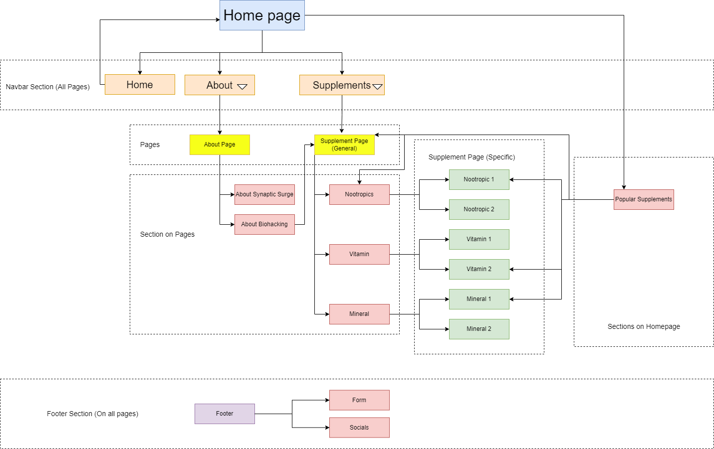

    
<h3>Skeleton</h3>

<h4>Desktop Wireframes</h4>

    
<h5>Landing Page</h5>

    
<h5>About Page</h5>

    

    
<h5>Supplement Page (General)</h5>

    
<h5>Supplement Page (Specific)</h5>

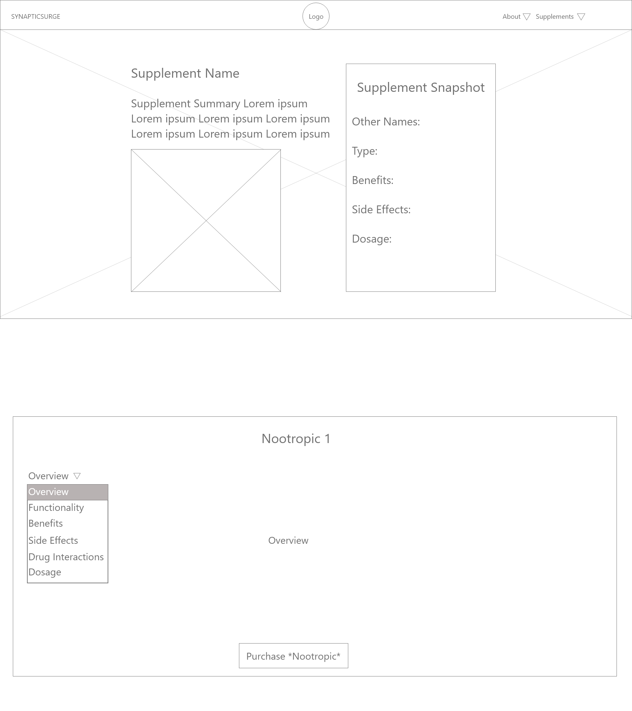

    
<h5>Footer</h5>

<h4>Tablet Wireframes</h4>

    
<h5>Landing Page</h5>

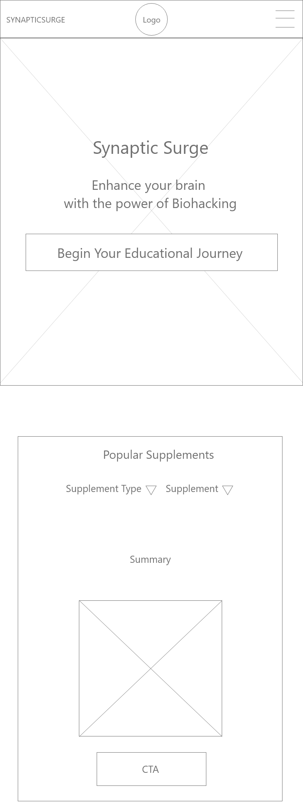

    
<h5>About Page</h5>

    
<h5>Supplement Page (General)</h5>

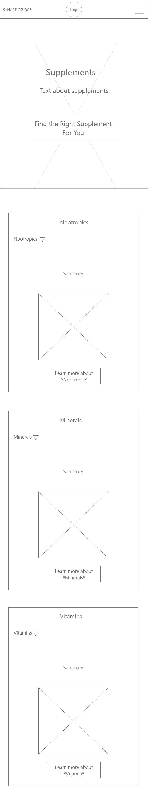

    
<h5>Supplement Page (Specific)</h5>

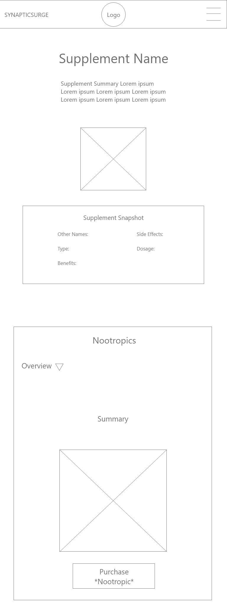

    
<h5>Footer</h5>

<h4>Mobile Wireframes</h4>

    
<h5>Landing Page</h5>

    
<h5>About Page</h5>

    
<h5>Supplement Page (General)</h5>

    
<h5>Supplement Page (Specific)</h5>

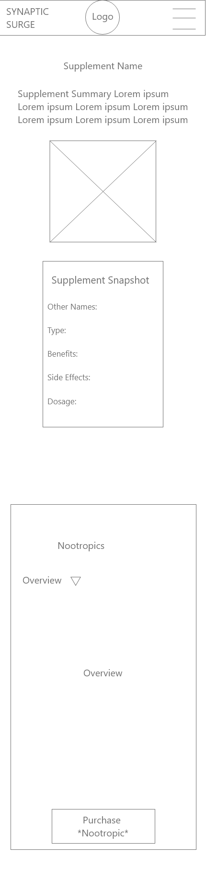

    
<h5>Footer</h5>

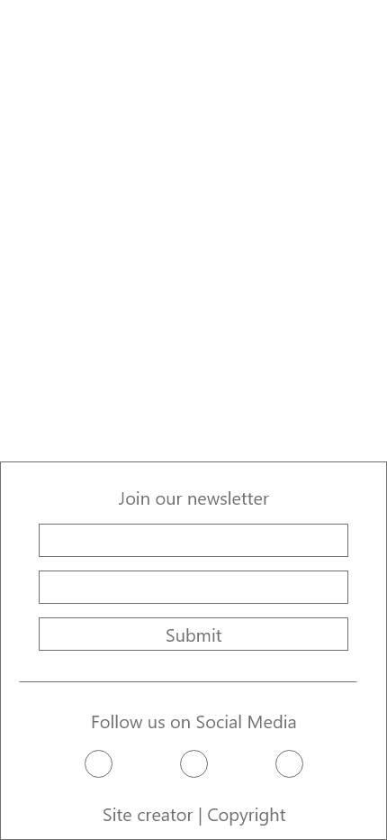

    
<h3>Surface</h3>

<h4>Fonts</h4>

Headings - [Roboto Slab](https://fonts.google.com/specimen/Roboto+Slab?query=Roboto+Slab)
I'm going with Roboto Slab for my headings. It's a cool mix of modern and classic, and it's got a style that really stands out. Plus, it's easy for anyone to read.

Body Text - [Open Sans](https://fonts.google.com/specimen/Open+Sans?query=Open+Sans)
For everything else, I'm using Open Sans. It's incredibly versatile, and it looks good on any device. It's simple, friendly, and really easy to read - just what I need for my site's main text.

<h4>Colours</h4>

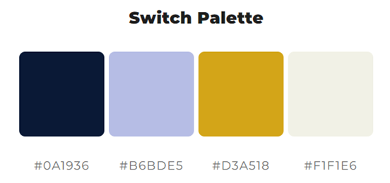

- #0A1936 (Dark Navy Blue): I could use this as my primary color. It's great for major elements like the header, footer, or primary background color. I can also use it for important text.
- #B6BDE5 (Light Pastel Blue): This light and airy color could serve as a background color for certain sections to provide contrast with the darker blue. It's also a good color for secondary text, borders, or backgrounds of cards or insets where I want the content to stand out.
- #D3A518 (Dark Goldenrod): This is a strong, vibrant color that can serve as a highlight or accent color. I can use it for calls to action, buttons, or other elements I want to draw attention to. As it's quite a rich color, using it sparingly can make my design pop without being overpowering.
- #F1F1E6 (Very Pale Yellow): This very light color is excellent for backgrounds, especially if I want a slightly warmer tone than pure white. I can also use it for elements like tooltips, drop-down menus, or modals where I want a contrast with the main page.

<h4>Technologies Used</h4>

<h5>Languages</h5>

- HTML
- CSS
- Javascript

<h5>Websites, Software & other Tools</h5>

- [Codeanywhere](https://codeanywhere.com/solutions/collaborate) This is was my IDE for the project.
- [CodePen](codepen.io) I used this to test code outside of [Codeanywhere](https://codeanywhere.com/solutions/collaborate) so that I didn't use up hours unnecessarily. I also used it to find the right filter colour for my SVGs.
- [Git](https://git-scm.com/) Used to commit and push code to [Github](https://github.com/).
- [Github](https://github.com/) This was used as a remote repository and I also used Github pages to host the live site.
- [Conventional Commits](https://www.conventionalcommits.org/en/v1.0.0-beta.2/) Used to learn and stick to a conventional commit framework.
- [Midjourney](https://www.midjourney.com/) I used this AI tool for image generation.
- [Photoshop](https://www.adobe.com/uk/products/photoshop.html) Used for Creating, Editing, resizing and converting images to webp.
- [Illustrator](https://www.adobe.com/uk/products/illustrator.html) Used to create vectors from AI generated images and perosnally made images
- [AdobeXD](https://helpx.adobe.com/support/xd.html) Used to create wireframes.
- [Google Fonts](https://fonts.google.com/) Sourcing fonts.
- [Google Webfonts Helper](https://gwfh.mranftl.com/fonts) Used to download google fonts in WOFF2 format.
- [W3Schools](https://www.w3schools.com/) Used to learn more about CSS and Javascript.
- [CSS Tricks](https://css-tricks.com/snippets/css/a-guide-to-flexbox/) Used for a clearer, more comprehensive look at flexbox.
- [MDN Web Docs](https://developer.mozilla.org/en-US/docs/Web/JavaScript) Used to learn more about Javascript.
- [Youtube](https://www.youtube.com/) Used to learn more about Git, CSS and Javascript.
- [Codepen](https://codepen.io/sosuke/pen/Pjoqqp) Used to learn more about CSS and Javascript.
- [Am I Responsive?](https://ui.dev/amiresponsive) Used to create mock-ups for various screen sizes.
- [Color Space](https://mycolor.space/) Used to create colour palette.
- [Dynamic Drive](http://tools.dynamicdrive.com/favicon/) Used to create favicon.

<h2>Features</h2>

<h3>Navigation</h3>
Each page features a responsive navigation bar with the brand name on the left and brand logo in the middle. To the right are the other navigational elements; About & Supplements. About & Supplements can be hovered over to reveal more navigation items.

On mobile, the brand logo is on the left and the brand name is hidden. On the right is a hamburger menu which reveals the navigation menu when touched.

<h3>Hero Section</h3>
Each page has a hero section that often has a heading and then a small paragraph related to the page that the user is on. There are footnotes that open up in a new tab, linking to scientific studies to back up the cliams. There is a call to action button on each hero section which takes the user further down the page.

On the about page there are three CTA buttons so the user can quickly navigate to nootropics, minerals or vitamins.

For the specific supplement pages, the heading and paragraph is replace by a table that features the relevant supplement and a few highlights about it.

<h3>Dropdown Section</h3>
Each page has a dropdown section which the CTA buttons on the hero section take the user to. In this section the user can interact with the dropdowns to see the content that they wish to see.

On the home page the user can switch the content between the popular supplements provided.

On the about page, the information on this page is static and it has a paragraph and video educating the user about Biohacking.

On the general supplement page there are three dropdown sections, so the user can choose content whether they're interesting in nootropics, minerals or vitamins.

Finally, on the specific supplement pages the user can switch between: overview, functionality, benefits, side effects, drug interactions and dosage. Each specific supplement has a CTA to purchase the relevant supplement.

<h3>Footer</h3>
Each page has a footer which contains a form (with form validation) that users can fill out to join Synaptic Surge's newsletter. When a user fills this page out they are taken to a thank you page. Below the form are the social media icosn which open on another page.

<h3>Thank You Page</h3>
When the form is submitted the user is taken to the thank you page, where they can navigate back to the homepage with a button.

<h2>Bugs</h2>

<h3>Known Bugs</h3>

- Mobile Menu - Clicking on nav content that is on the same page will scroll but the menu won't close. E.g. about.html > #dropdown-section-about
- Tap Highlight - Clicking a link on mobile has an unintended highlight (this highlight is a default browser behaviour) 

<h3>Fixed Bugs</h3>

- [Nav Spacing](https://github.com/CharlieMcGoldrick/ci-ms1-synaptic-surge/commit/25d195257de602621673bfcb61336389f6979bc9)  - Delete extra li tag to fix nav spacing.
- [Slow Site](https://github.com/CharlieMcGoldrick/ci-ms1-synaptic-surge/commit/0f8b56564a76a41ac5e81ceb09cbd3a894df15a2) - Change images from png to webp.
- [ID Not Being Found](https://github.com/CharlieMcGoldrick/ci-ms1-synaptic-surge/commit/e33d28e2946d4e21112efacc151467e7037f6767) - Add '-' to supplement dropdown in index-cascading-dropdown.js.
- [Code Outside Of Appropriate Function](https://github.com/CharlieMcGoldrick/ci-ms1-synaptic-surge/commit/9decc403ef6dee70a35cb45b1d537cfb3ee32646) - Move while and for loop into generate function.
- [DOMContentLoaded Not Working](https://github.com/CharlieMcGoldrick/ci-ms1-synaptic-surge/commit/6201b140a04b9e731cfd7a23857e7a4958c198b3) - Add missing ')' at the end of event.
- [Content Not Appearing](https://github.com/CharlieMcGoldrick/ci-ms1-synaptic-surge/commit/4dbdbd4d7a04b0419d651c77e9aab1a0649965c3) - Change 'delete' to 'remove' so that the content doesn't disappear entirely.
- [Class Not Being Found](https://github.com/CharlieMcGoldrick/ci-ms1-synaptic-surge/commit/d6aff89ba67e6d6c2877a338bdf1508a61120d8b) - Change 'getElementById' to 'getClementsByClassName'. Also add 'Array.from.
- [Too Many Dashes In Comments Validation](https://github.com/CharlieMcGoldrick/ci-ms1-synaptic-surge/commit/afbc4ecb91141fe49fae868ea79fcc88a8652480) - Remove any extra '-' from comments.
- [Animation Timing Function Not Working](https://github.com/CharlieMcGoldrick/ci-ms1-synaptic-surge/commit/ca251f00a2b790d245336a21ca43fed1cde3bdfc) - Remove extra 'a'.
- [Buttons In A Tag Validation](https://github.com/CharlieMcGoldrick/ci-ms1-synaptic-surge/commit/f460f3228532b311585c8429ab62cf7fb3136912) - Remove buttons from a tags for validation.
- [Scrollbar On X](https://github.com/CharlieMcGoldrick/ci-ms1-synaptic-surge/commit/2fb0dbf6612574bd3c80d21c318d164cc4b63a69) - Add 'overflow-x: hidden;' to stop overflow after adding '.side-panel'.
- [Z-Index Not Working On Hamburger](https://github.com/CharlieMcGoldrick/ci-ms1-synaptic-surge/commit/48fcee1ce04538d06acaea7af7ddde45b41bbd34) - Add 'position: relative;' so that 'z-index' works.
- [Non Li In Ul Validation](https://github.com/CharlieMcGoldrick/ci-ms1-synaptic-surge/commit/9645c248ebc5f8cf6b930ee23ecaf200310f3d22) - Add 'hamburger' div to li for validation.
- [Mobile Nav Disappeared](https://github.com/CharlieMcGoldrick/ci-ms1-synaptic-surge/commit/59330d1100195efe366042f2daabf281cf5071da) - Add 'mobile-nav' again after I accidently deleted it.
- [Wrong Content](https://github.com/CharlieMcGoldrick/ci-ms1-synaptic-surge/commit/2aff5f9cb3288db42e9959846b55260fd0a41771) - Swap content between '404.html' and 'thank-you.html'.
- [Youtube Link Not Working](https://github.com/CharlieMcGoldrick/ci-ms1-synaptic-surge/commit/69d2e47f19d3ec0c260d93477693cf120579ad1a) - Add actual embed link so youtube video shows.
- [404 Error With Links](https://github.com/CharlieMcGoldrick/ci-ms1-synaptic-surge/commit/47434071b19b64852ebeb4779fc92399044e655f) - Reorganise file path and delete any unnecessary parts of a link.
- [Button Hover Colour](https://github.com/CharlieMcGoldrick/ci-ms1-synaptic-surge/commit/2fbcd5c78e91582ed97bcadd55af6a66662cac23) - Add 'color: var(--primary-colour);' to appropriate hover class.
- [Wrong Stylesheet](https://github.com/CharlieMcGoldrick/ci-ms1-synaptic-surge/commit/f195b92115bcf29aa4ac5a78623236c61f766222) - Add correct stylesheet to 'thank-you.html'.
- [Mobile Menu Flashing On Page Load](https://github.com/CharlieMcGoldrick/ci-ms1-synaptic-surge/commit/f195b92115bcf29aa4ac5a78623236c61f766222) - Add inline CSS so that the mobile menu loads in hidden.
- [Table Off Page On Mobile](https://github.com/CharlieMcGoldrick/synaptic-surge/commit/acb1fbfaaeaa0baf8be65dcd4bcd0f12f242a6d8) - Change VH on 991px screens and below to be 100vh for the supplement specific page.
- [Mobile Hover Styles Not Working With Touch](https://github.com/CharlieMcGoldrick/synaptic-surge/commit/acb1fbfaaeaa0baf8be65dcd4bcd0f12f242a6d8) - Add hover styles to it's own section with the necessary media query and then also add touch styles.

<h2>Validation, Performance, Accessibility & Testing</h2>

<h4>Validation</h4>
Every page passed [w3C HTML Validation](https://validator.w3.org/nu/)

<h4>HTML Validation</h4>

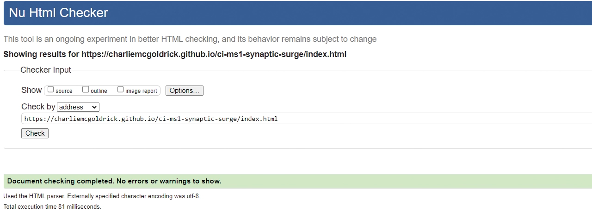
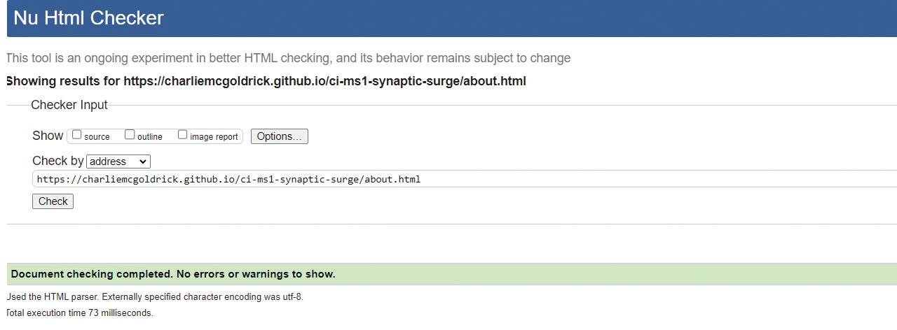
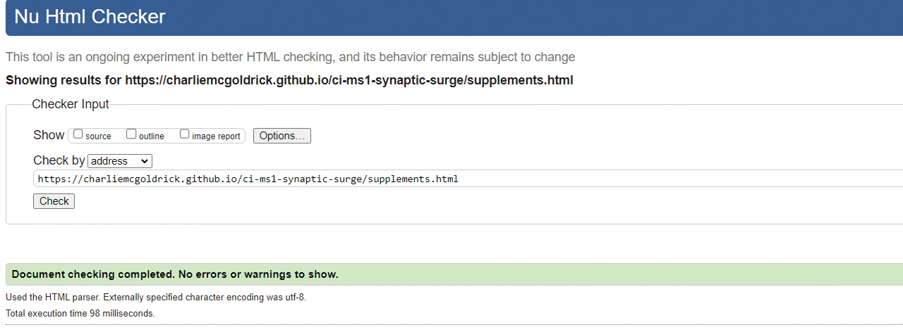
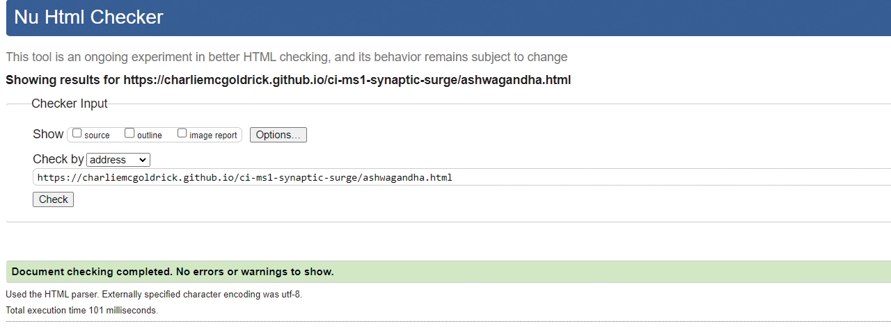
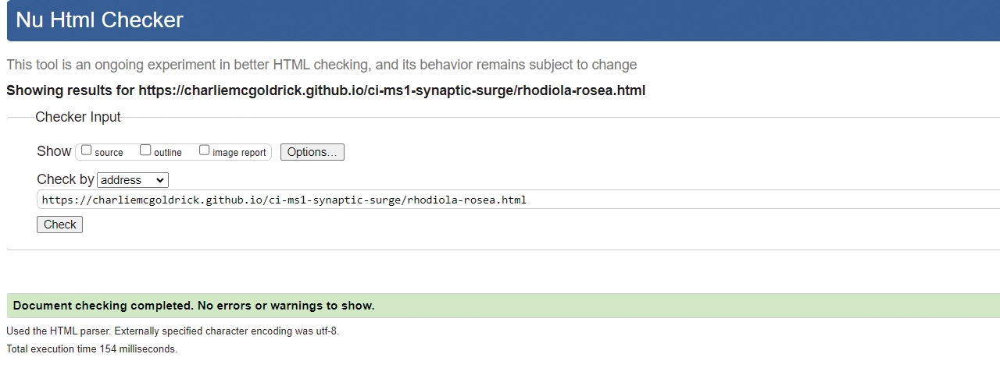

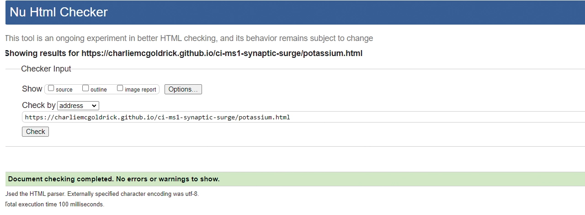
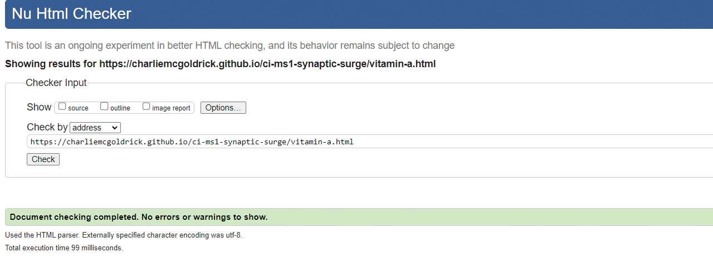

Every page passed [w3C CSS Validation](https://jigsaw.w3.org/css-validator/#validate_by_input)

<h4>CSS Validation</h4>

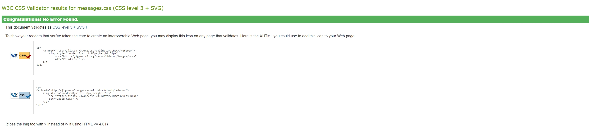
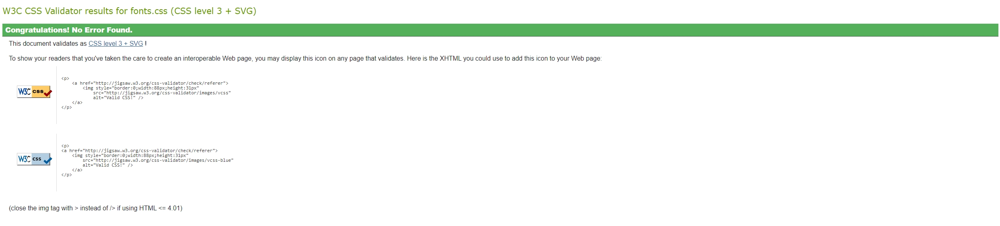

<h3>Performance & Accessibility</h3> 
I used [WAVE Web Accessibility Evaluation Tool](https://wave.webaim.org/) and all pages passed with 0 errors. I also used [Google Lighthouse](hhttps://developer.chrome.com/docs/lighthouse/overview) and every page was in the high greens for performance, accessbility and best practises.

<h4>Google Lighthouse</h4>

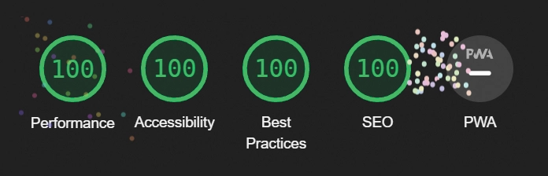
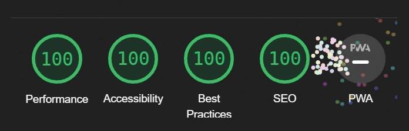
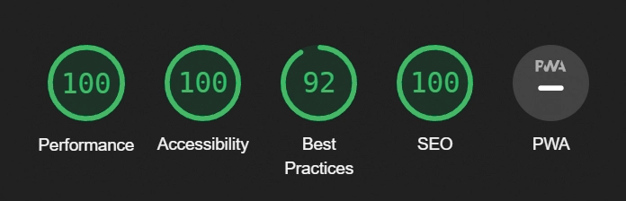
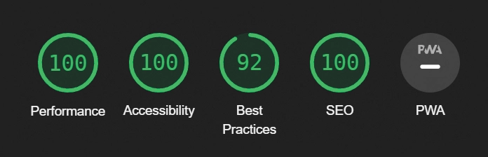
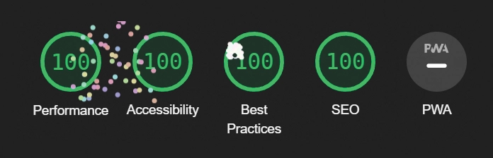
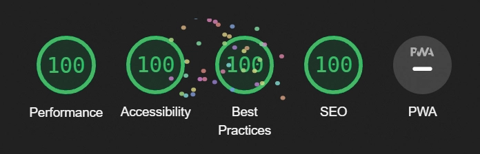
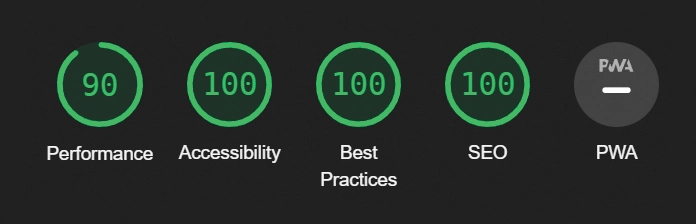
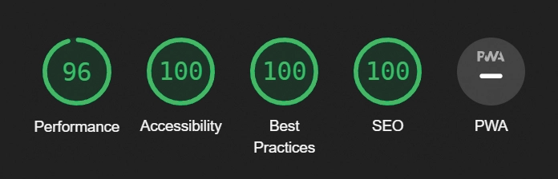
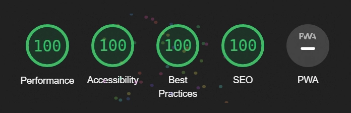

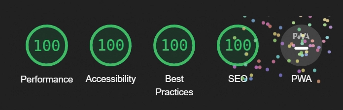
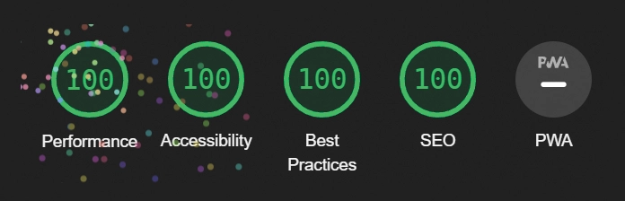
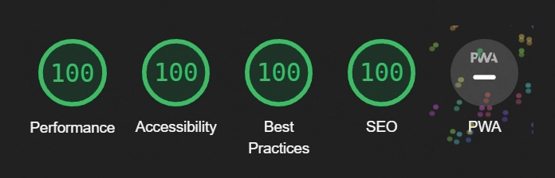
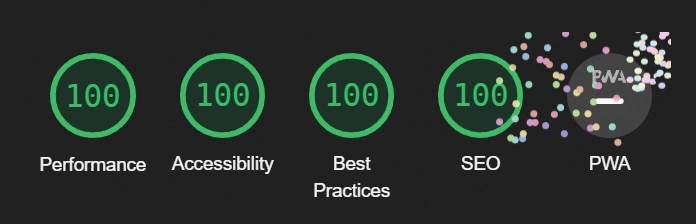
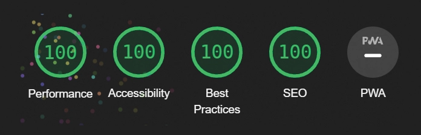
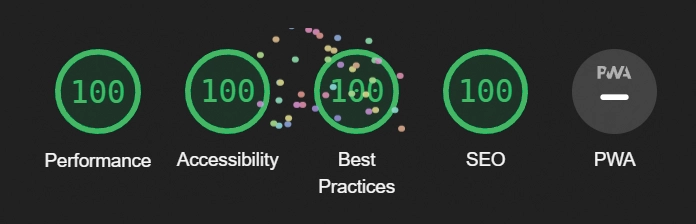
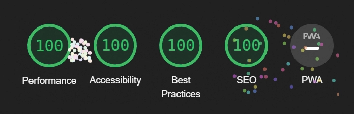
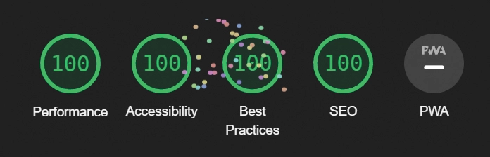

<h3>Testing</h3>
1. I have tested the functionality. All of the links go to the desired locations and the link hover styles work. If the link is external then it opens up on another page. The navbar slides down when it's hovered and the hamburger menu opens when using a touch scrren. The form submits on all pages and the user is greeted with a thank you page that has a button to take them back.
2. The website works as intended on Chrome, Firefox and Edge.
3. I've tested the website on a laptop (1366x766px) and a Samsung Galaxy S9 (360x740px).

<h2>Deployment</h2>

I have deployed this website on GitHub Pages. To do this yourself, follow the steps below:

1. Log in to your GitHub account and navigate to the repository you wish to deploy.
2. Click on the "Settings" tab.
3. In the left-hand navigation menu, click on the "Pages" button.
4. Under "Source", click on the dropdown that says "None" and then select "main".
5. Wait for a few seconds and the page should automatically refresh.
6. In GitHub Pages, you can see the link to your published site.

To make a clone of this repository, follow these steps:

1. Login to your GitHub account.
2. Go to the repository by visiting the link: [Charlie McGoldrick Github - Synaptic Surge Repo](https://github.com/CharlieMcGoldrick/ci-ms1-synaptic-surge).
3. Click the "Code" button and then use the copy button next to the link to copy the link.
4. In your IDE of choice, open a new terminal and use the following clone command:
   `git clone <https://github.com/CharlieMcGoldrick/ci-ms1-synaptic-surge.git>`.
5. You will now have a copy of the repository in you local version.

To fork this repository, follow these steps:

1. Log in to your GitHub account.
2. Go to the repository you want to fork, which is located at:  [Charlie McGoldrick Github - Synaptic Surge Repo](https://github.com/CharlieMcGoldrick/ci-ms1-synaptic-surge).
3. In the top-right corner of the repository page, click on the "Fork" button
4. GitHub will prompt you to select where you want to fork the repository. Choose your personal account or organization.
5. Wait for the forking process to complete. Once it's done, you will be redirected to your forked repository under your GitHub account.

NOTE: Any changes pushed to the main branch automatically show up on the website.

<h2>Credits</h2>

- [W3Schools](https://www.w3schools.com/) Used to learn more about CSS and Javascript, such as flexbox [Flexbox](https://www.w3schools.com/css/css3_flexbox.asp) and [Cascading Dropdowns](https://www.w3schools.com/howto/howto_js_cascading_dropdown.asp).
- [CSS Tricks](https://css-tricks.com/snippets/css/a-guide-to-flexbox/) Used for a clearer, more comprehensive look at flexbox.
- [MDN Web Docs](https://developer.mozilla.org/en-US/docs/Web/JavaScript) Used to learn more about Javascript.
- [Kevin Powell](https://www.youtube.com/@KevinPowell) Helpful CSS tips, like the use of *inset*.
- [Free Code Camp](https://www.youtube.com/@freecodecamp) To learn JavaScript.
- [Midjourney](https://www.midjourney.com/) I used this AI tool for image generation.
- [CodePen](https://codepen.io/sosuke/pen/Pjoqqp) Filter generation to convert black to target hex colour.
- [Am I Responsive?](https://ui.dev/amiresponsive) Used to create mock-ups for various screen sizes.
- [Color Space](https://mycolor.space/) Used to create colour palette.
- [Dynamic Drive](http://tools.dynamicdrive.com/favicon/) Used to create favicon.

<h2>Acknowledgements</h2>

- Thank you to my mentors, Graeme Taylor, Brian Macharia, and Code Institute (including the Slack community), for the great support, advice, and guidance.
- Thank you to my friends and family for their patience and understanding whilst working on this project.

